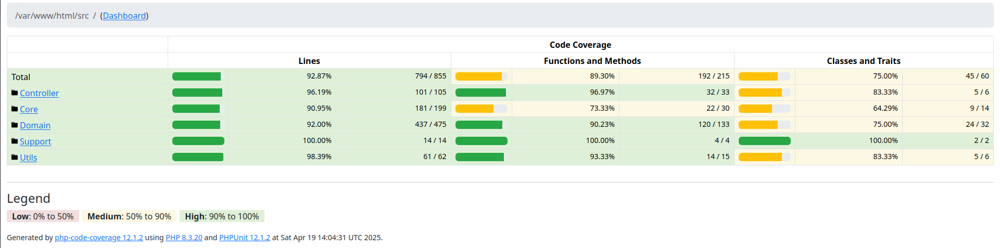

# Sistema de Gestão Acadêmica 📚

Projeto fullstack construído em **PHP puro** (sem frameworks) com **Vue 3**, que permite o gerenciamento de alunos, turmas e matrículas, além de autenticação de usuários. A aplicação é totalmente dockerizada para facilitar a instalação e execução.

---

## ✨ Funcionalidades

- Login seguro com autenticação JWT;
- Cadastro, listagem, edição e exclusão de **alunos**, **turmas**, **usuários** e **matrículas**;
- Matrícula de alunos com validações;
- Busca de alunos por nome;
- Contagem de alunos em cada turma;
- Validação de CPF e senha forte;
- Interface moderna com Vue 3 e Tailwind CSS;
- Documentação da API via Swagger (OpenAPI);
- Testes unitários completos com PHPUnit.

---

## 🧑‍💻 Tecnologias Utilizadas

### Backend

- **PHP >= 8.1**
- **MySQL 8**
- **JWT** (`firebase/php-jwt`)
- **Dotenv** (`vlucas/phpdotenv`)
- **Swagger UI (OpenAPI)**
- **Docker e Docker Compose**
- **PhpMyAdmin**
- **PHPUnit** (testes)

### Frontend

- **Vue 3**
- **Vite**
- **Tailwind CSS**
- **Pinia** (state management)
- **Vue Router**
- **Axios**
- **SweetAlert2**, **Flowbite**, **Vee Validate**, **Vue Toastify**, **V-Money**, **Simple Datatables**

---

## 📥 Clonando o Repositório

Para obter uma cópia local do projeto, execute:

```bash
git clone https://github.com/davidaugusto89/gestor-academico.git
cd gestor-academico
```

----

## ⚙️ Como Executar

### Pré-requisitos


- Git
- Docker
- Docker Compose
- Bash (Linux/Mac ou Git Bash no Windows)

### Setup Automático

```bash
chmod +x scripts/setup.sh
./scripts/setup.sh
```

O script realiza:

- Criação dos arquivos `.env`;
- Subida dos containers com Docker;
- Importação do banco via `sql/dump.sql`;
- Exibição de URLs úteis no terminal.

---

## 🔐 Credenciais de Acesso

| Tipo    | E-mail              | Senha             |
|---------|---------------------|-------------------|
| Admin   | admin@example.com   | SenhaForte123!    |
| Usuário | user@example.com    | SenhaForte123!    |

---

## 🔗 URLs de Acesso

| Serviço           | URL                              |
|-------------------|----------------------------------|
| Frontend          | http://localhost                 |
| Backend API       | http://localhost/api/health      |
| Swagger UI        | http://localhost/api/docs        |
| PhpMyAdmin        | http://localhost:8081            |
| Coverage Report   | http://localhost/coverage-report |

---

## 📂 Estrutura de Pastas

```
├── backend
│   ├── src
│   │   ├── Controller
│   │   ├── Core
│   │   ├── Domain
│   │   ├── Routes
│   │   ├── Support
│   │   └── Utils
│   ├── tests
│   │   ├── Unit
│   │   └── Fake
│   ├── public
│   │   └── docs (Swagger)
│   ├── phpunit.xml
├── frontend
│   ├── src
│   │   ├── components
│   │   ├── views
│   │   ├── layouts
│   │   ├── services
│   │   ├── stores
│   │   └── router
│   ├── public
│   └── tests (Vitest + Cypress)
├── scripts
│   └── setup.sh
├── sql
│   └── dump.sql
├── docker-compose.yml
└── README.md
```

---

## 📑 Documentação da API

A documentação da API está disponível em:

> http://localhost/api/docs

A especificação OpenAPI (`swagger.json`) está incluída no backend, com suporte completo via Swagger UI.

### 🔌 Testes de API com Insomnia

Este projeto inclui uma coleção do [Insomnia](https://insomnia.rest/) para facilitar os testes dos endpoints.

📁 [Download da coleção Insomnia](docs/insomnia/insomnia_export.yaml)

Para importar no Insomnia:
1. Abra o Insomnia.
2. Vá em **File > Import > From File**.
3. Selecione o arquivo acima.

---

## ✅ Testes Automatizados

Este projeto possui cobertura de testes automatizados para o backend, escritos com **PHPUnit** e analisados com **Xdebug**.

### 🔧 Comandos disponíveis

Executa os testes unitários:
```bash
docker exec -it gestor-academico-backend composer test
```

Gera o relatório de cobertura completo (HTML + XML):
```bash
docker exec -it gestor-academico-backend composer test:coverage
```

Gera apenas o relatório de cobertura em HTML:
```bash
docker exec -it gestor-academico-backend composer test:coverage:html
```

Gera apenas o relatório de cobertura em XML (ex: Sonar):
```bash
docker exec -it gestor-academico-backend composer test:coverage:xml
```

> ℹ️ O foco do projeto está no **backend PHP**, portanto os testes estão concentrados nessa camada.
> O frontend (Vue 3) possui estrutura para testes (Vitest e Cypress), mas os testes ainda não foram implementados.

---

### 📊 Cobertura de Testes



- Cobertura atual: **92%**
- Gerado com `PHPUnit` + `Xdebug`
- Relatório acessível em: [http://localhost/coverage-report/index.html](http://localhost/coverage-report/index.html)

---

## 🧑 Autor

Desenvolvido por [David Augusto](https://github.com/davidaugusto89)

Licenciado sob a licença MIT.